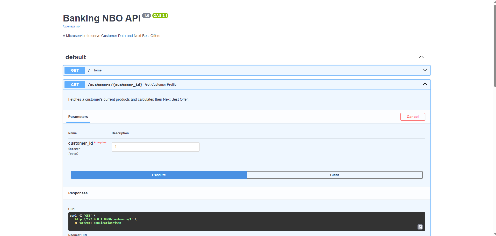

 🔌 Banking Next Best Offer (NBO) Microservice



 📖 Overview
This project is a REST API built with FastAPI that serves real-time product recommendations to banking frontend applications.

It acts as the "Serving Layer" for the Next Best Offer (NBO) engine. Instead of static reports, this API allows mobile apps and websites to query a customer's profile and receive an instant, AI-driven product recommendation based on Association Rule Learning.

 🛠️ Tech Stack
 Python (FastAPI): High-performance web framework for building APIs.
 SQL Server: Data persistence and rules storage.
 SQLAlchemy: Database ORM.
 Pydantic: Data validation and serialization.
 Swagger UI: Automatic interactive API documentation.

 🔌 Endpoints

 `GET /customers/{customer_id}`
Returns a customer's current product portfolio and their top AI-driven recommendation.

Example Response:
```json
{
  "customer_id": 50,
  "holdings": ["Checking Account", "Mortgage"],
  "top_recommendation": {
    "product": "Home Insurance",
    "probability": 90.0,
    "reason": "High correlation with your existing products (Lift: 6.0)"
  }
}